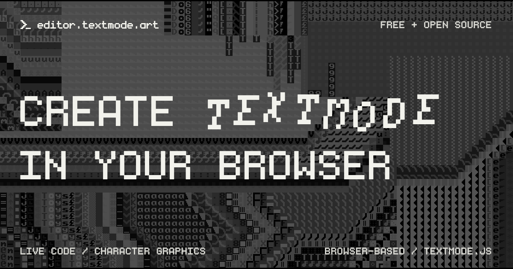

# editor.textmode.art (✿◠‿◠)

|   |   |   |
|:-------------|:-------------|:-------------|

`editor.textmode.art` is a browser-based creative-coding environment for
[textmode.js](https://github.com/humanbydefinition/textmode.js). Write a
sketch, see it run as you type, and shape moving text, characters, colours,
layers, filters, and synthesis without setting up a local toolchain. Your work
and editor preferences stay in your browser, so returning to an idea is as
simple as reopening the editor.

## Features

- **Graphics engine:** [textmode.js](https://github.com/humanbydefinition/textmode.js) provides the tools for drawing and animating textmode graphics in the browser.
- **High-performance editor:** Monaco Editor *(the engine behind VS Code)* with
  custom syntax highlighting and tailored type definitions.
- **Audio input:** Browser microphone and line-input analysis supplies FFT and
  waveform data to audio-reactive sketches.
- **Local persistence:** Code and editor settings are saved automatically in
  browser storage.
- **Gallery:** Discover reviewed community sketches at random or through stable
  `/s/<slug>/` links, then use their source as a starting point.
- **Share links:** Package a sketch’s code and settings in a URL. Recipients
  choose whether to run shared code.
- **Responsive workspace:** Create on desktop or mobile without a separate app.

## Make something

- Visit [editor.textmode.art](https://editor.textmode.art).
- Start from **Examples**, a random gallery sketch, or a blank editor.
- Plug in sound if the sketch calls for it.
- Keep iterating; the workspace saves as you go.

## Share something

Use the **Share** button to create a URL for your sketch.

- The URL includes your code and editor settings.
- Shared code stays locked until the recipient chooses to run it.
- Recipients can open the link in the browser - no installation required.

## Contribute a gallery sketch

Have a sketch worth sharing more widely? Submit it to the repository-backed
gallery. Gallery entries can be loaded from stable `/s/<slug>/` links and from
the editor’s random-sketch action.

Read [CONTRIBUTING.md](CONTRIBUTING.md) for the sketch format, metadata,
deterministic-rendering requirements, Open Graph preview workflow, and
contribution terms.

## License

This application is licensed under the **GNU Affero General Public License v3.0** - see the [LICENSE](LICENSE) file for details.

Gallery sketches under [`sketches/`](sketches/) are included under the contribution terms in [`CONTRIBUTING.md`](CONTRIBUTING.md) and may declare an additional standalone license in their `meta.json`.
