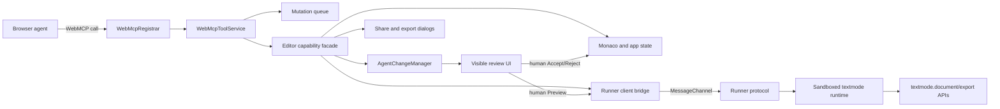

# WebMCP Integration Plan for editor.textmode.art

- Status: implementation-ready
- Prepared: 2026-08-26
- Challenge deadline: 2026-09-03 at 13:00 PT / 22:00 CEST
- Primary repository: `editor.textmode.art`
- Supporting repository: `runner.textmode.art`

## Executive recommendation

Build an agent-native creative coding workflow in `editor.textmode.art`, using
WebMCP's imperative API from the top-level editor document. The integration
should let an agent understand the current sketch and rendered textmode artwork,
propose a complete code revision, select an example as a starting point, and
prepare exports or a share link. Every action must update the same interface the
human is using.

The signature experience is a staged collaboration loop:

1. The agent reads a bounded view of the editor and artwork.
2. The agent stages a named code proposal without executing or persisting it.
3. The editor opens a visible diff with the agent's summary.
4. The human chooses **Preview**, **Accept and run**, or **Reject**.
5. Preview runs only after the human's click, inside the existing cross-origin
   runner sandbox.
6. Accept persists the candidate; reject restores the accepted sketch.

This is stronger than a chatbot attached to the editor. It uses WebMCP for
structured discovery and reliable action while preserving the editor's visual,
human-first workflow. It also creates a memorable demo: ask for an artistic
change, inspect the proposed diff, preview the new animation live, approve it,
then prepare an export and share link.

No implementation can guarantee a hackathon win. This plan is designed to
maximize the published judging criteria, with special attention to WebMCP
leverage because it is the first tie-break criterion.

## Decision record

### Product thesis

> `editor.textmode.art` becomes a shared creative surface where an agent can
> understand semantic textmode artwork and propose changes, while the artist
> remains visibly in control of execution and publication.

### Architecture decision

Register WebMCP tools in the top-level `editor.textmode.art` document. Route
runtime-dependent operations through explicit, capability-gated messages to the
existing `runner.textmode.art` iframe.

Do not register the challenge tools from a `textmode.js` plugin in the runner.
That alternative would place tool ownership in a cross-origin sandbox document,
separate tool execution from the host editor's state and review UI, and require
cross-origin tool exposure. The host already owns code, persistence, dialogs,
share state, and the runner lifecycle; it is the correct application boundary.

### Challenge scope

The challenge implementation should modify two repositories:

- `editor.textmode.art`: WebMCP registration, tool application services, staged
  change state machine, agent activity UI, review UI, and prepared-artifact UI.
- `runner.textmode.art`: narrow protocol/client additions for syntax validation,
  runtime summaries, bounded semantic inspection, and export preparation.

The challenge MVP should not require changes to:

- `textmode.js-dev`: its plugin lifecycle is useful, but WebMCP registration is
  an application concern in this architecture.
- `textmode.export.js`: its existing `toJSON`, `toString`, `toSVG`, and blob
  exports already provide the required runner-side primitives.

A reusable WebMCP adapter can be extracted after the challenge, once the draft
API and the editor contracts have proven stable. It should target an
application-level capability port, not assume direct access to a textmode
runtime.

## Source of truth and constraints

This plan is based on the repository state and public guidance available on
2026-08-26.

### Challenge requirements

The official challenge materials establish the following constraints:

- The submission window ends on 2026-09-03 at 13:00 PT.
- Existing applications are allowed, but only meaningful work completed during
  the challenge period is judged. Timestamped commits and clear documentation
  must separate the new work.
- Judges must be able to use a live app in the ChatGPT in-app browser or a
  compatible Chrome configuration.
- The submission needs a public source repository, visible open-source license,
  setup instructions, project description, and a public demo video under three
  minutes.
- The implementation must contain working calls to
  `document.modelContext.registerTool`.
- Judging is equally weighted across WebMCP leverage, execution, potential
  impact, and creativity/ambition. Ties are resolved in that order.

### WebMCP baseline

Implement against the 2026-08-19 Web Machine Learning Community Group draft:

- Feature-detect `document.modelContext` as a progressive enhancement.
- Use the imperative `document.modelContext.registerTool(tool, { signal })`
  API.
- Provide concise `name`, localized-ready `title`, `description`, JSON
  `inputSchema`, `execute`, and annotations.
- Pass each execution's `AbortSignal` through all cancellable application and
  runner operations.
- Use `readOnlyHint` accurately.
- Set `untrustedContentHint` for tools returning user-authored code, gallery
  content, runtime diagnostics, or rendered cell data.
- Keep names to valid ASCII alphanumeric, underscore, hyphen, or dot characters.
  The draft allows 128 characters; this plan uses Chrome's stricter recommended
  budget of 30.
- Keep descriptions below 500 characters, parameter descriptions below 150,
  and normal serialized results below 1,500 characters.
- Register only tools that are meaningful in the current page state, while
  avoiding excessive registration churn.
- Do not use `exposedTo`; retain the default same-origin exposure.
- Do not add `allow="tools"` to the cross-origin runner iframe.

The specification is an experimental Community Group report, not a W3C
standard. All direct API dependencies therefore belong behind one small adapter
and one ambient type declaration. Production behavior without WebMCP support
must remain unchanged.

### Primary references

- [OpenAI WebMCP Challenge](https://openai.com/webmcp-challenge/)
- [Official challenge rules](https://webmcp.devpost.com/rules)
- [WebMCP Community Group draft](https://webmachinelearning.github.io/webmcp/)
- [WebMCP explainer and lifecycle](https://github.com/webmachinelearning/webmcp/blob/main/README.md)
- [Chrome WebMCP overview](https://developer.chrome.com/docs/ai/webmcp)
- [Chrome WebMCP best practices](https://developer.chrome.com/docs/ai/webmcp/best-practices)
- [Chrome WebMCP tool security](https://developer.chrome.com/docs/ai/webmcp/secure-tools)

## Synthesis of the referenced conversation

The referenced “WebMCP textmode ideas” conversation identified the right broad
direction: make the editor agent-native, use semantic artwork inspection, stage
agent changes, and demonstrate a complete inspect-edit-export workflow.

Retain these ideas:

- Use the editor as the flagship experience rather than adding a chat panel.
- Give the agent real application capabilities such as inspecting state,
  changing a sketch, selecting examples, exporting, and sharing.
- Build semantic inspection on the `textmode.document` representation from
  `textmode.export.js` instead of relying on screenshots alone.
- Show a live diff and explicit accept/reject controls.
- Keep the demo focused on a coherent artist-and-agent workflow.
- Make challenge-period changes easy for judges to identify.

Revise these ideas:

- Replace a runner-side `textmode.webmcp.js` plugin with host-owned registration
  and a narrow runner bridge.
- Replace immediate `stage_sketch` execution with a true proposal. Generated
  code is not run until the human presses Preview or Accept and run.
- Replace unbounded `get_sketch` and `inspect_artwork` results with paginated,
  budgeted reads.
- Replace `export_artwork` with `prepare_export`: the tool creates an artifact
  and opens a host dialog; a human click performs the download.
- Replace `create_share_link` with `prepare_share`: the tool opens the existing
  share workflow but does not copy, navigate, or publish silently.
- Do not expose an agent-callable “accept” tool. Approval belongs exclusively to
  the human interface.

Defer these ideas:

- A standalone reusable WebMCP package for every textmode application.
- GIF or video generation through WebMCP.
- Arbitrary patch/edit operations in the first release.
- Declarative WebMCP; the relevant functionality is programmatic and the draft
  declarative section is still incomplete.

## Current system analysis

Repository baselines at planning time are intentionally recorded so challenge
work can be distinguished from pre-existing functionality:

| Repository | Branch | Baseline commit | Challenge role |
| --- | --- | --- | --- |
| `editor.textmode.art` | `dev` | `8cd1d40` | Host integration and human-agent UX |
| `runner.textmode.art` | `dev` | `b0e8d36` | Sandboxed runtime query/export bridge |
| `textmode.js-dev` | `dev` | `5ba12380` | Existing runtime API; no MVP change |
| `textmode.export.js` | `dev` | `36bf89a` | Existing semantic/export API; no MVP change |

These hashes document the inspected baseline, not a request to reset any
worktree. Existing untracked or unrelated local work must be preserved and kept
out of challenge commits.

### editor.textmode.art

The editor is a React 19, Vite 8, TypeScript, Zustand, and Monaco application.
Its architecture already provides most of the seams needed by WebMCP:

- `src/app/runtime/AppRuntime.ts` is the composition root. It owns the
  `TextmodeEngine`, sharing, gallery, audio, stable actions, and lifecycle.
- `src/textmode/TextmodeEngine.ts` is the host-facing facade for code execution,
  editor state, runner reset/reload, and recovery.
- `src/textmode/TextmodeController.ts` owns auto-execution and the current
  candidate transaction. Its existing `tryReplaceAndRun` probes and immediately
  commits successful code, so it must be separated into proposal, preview, and
  acceptance operations.
- `src/textmode/runtime/TextmodeRuntime.ts` wraps
  `IframeTextmodeRuntime`, including candidate timeouts and baseline recovery.
- `src/textmode/editor/TextmodeEditor.ts` owns the Monaco model and internal
  editor version. It needs a public monotonic revision and a safe way to support
  a disposable diff model.
- `src/platform/state/appStore.ts` already centralizes visible application state.
  Agent status and proposal state should follow the same pattern.
- `src/app/ui/AppShell.tsx` is the correct mount point for the status indicator,
  activity panel, proposal review dialog, and prepared-export dialog.
- `ShareManager` already treats incoming shared code as untrusted and read-only
  until the human explicitly runs it. Agent proposals should preserve and extend
  this trust model.
- `ShareService` and gallery loading already enforce a 300,000-character decoded
  sketch limit. The WebMCP code-input limit should be stricter.

The editor currently has no WebMCP code and no general browser E2E suite for the
runtime workflow. Unit and integration tests already use fake engines and are a
good fit for most new behavior.

### runner.textmode.art

The runner is an intentionally cross-origin, sandboxed application connected to
the editor with a `MessageChannel`:

- `@textmode/runner-protocol` defines strict discriminated messages and guards.
- `@textmode/runner-client` owns iframe creation, handshake, capabilities,
  request tracking, heartbeats, reconnects, and probe/run operations.
- The default iframe sandbox includes `allow-scripts` and `allow-same-origin`,
  but deliberately excludes `allow-downloads`.
- `TextmodeEngine` receives protocol commands and owns execution lifecycle.
- `TextmodeManager` creates the textmode instance with Export, Synth, Filters,
  and Figlet plugins, and can provide the initialized instance.
- `ExecutionContext.validateSyntax` already parses wrapped code without running
  it, but this operation is not exposed to the host protocol.
- Successful `probeCode` executes a candidate and updates reconnect state. That
  behavior is useful only after a human has requested preview.

User code runs through `new Function`. The textmode object is proxied to improve
resource cleanup and draw error handling, but browser globals are not a security
sandbox. The cross-origin iframe is the primary isolation boundary. This is why
WebMCP staging must not execute code invisibly and why the runner bridge must not
expose arbitrary evaluation.

### textmode.export.js

The existing `ExportPlugin` is sufficient for the challenge:

- `toJSON` and `toJSONString` expose the versioned `textmode.document` schema.
- Schema version `2.0.0` supports all layers, visibility, opacity, blend mode,
  transforms, grid dimensions, and semantic cells with character and colors.
- `toString`, `toSVG`, and image blob functions provide export primitives that
  do not require the runner to initiate a browser download.

Returning an entire document through a WebMCP tool would be too large and could
contain untrusted text. The runner should summarize metadata directly and only
extract a bounded cell region when requested. Export payloads should cross the
runner protocol to the host and remain outside the WebMCP result.

### textmode.js-dev

The core library has a mature plugin system, public canvas/grid/layer state, and
cleanup semantics. No core changes are required for the challenge. A runtime
plugin is the wrong owner for the editor's WebMCP lifecycle because it cannot
coordinate Monaco revisions, persistence, share trust, host dialogs, or the
human approval state machine.

## Target user experience

### Primary audience

- Creative coders who know the artistic result they want but need help shaping
  textmode.js code.
- Visual artists who can direct and judge a result without memorizing every API.
- Educators and learners exploring generative text art through inspectable code.
- Existing textmode.js users who want faster iteration without surrendering
  control of their sketch.

### Core jobs to be done

- “Explain what this sketch and rendered artwork are doing.”
- “Change the visual style while preserving the current structure.”
- “Start from an example that matches my goal.”
- “Fix the current runtime error.”
- “Prepare a portable artifact after I approve the result.”
- “Prepare a link I can review and copy.”

### Experience principles

1. **One shared surface.** Agent calls update the same editor, canvas, and dialogs
   the user sees.
2. **Proposal before execution.** New code is inert until a visible human action.
3. **No invisible finalization.** Downloads, clipboard writes, and acceptance are
   human actions.
4. **Semantic context first.** The agent receives code and textmode cell/layer
   data, not only pixels.
5. **Recoverable by construction.** Every preview has an accepted baseline and
   every proposal can be rejected.
6. **Progressive enhancement.** The editor remains fully functional when
   `document.modelContext` is absent.
7. **Visible agency.** The UI shows availability, calls, pending review, and
   outcomes without exposing full source in logs.

## Target architecture



### Ownership boundaries

| Concern | Owner | Reason |
| --- | --- | --- |
| Tool registration and cleanup | Editor host | Owns top-level document and app lifecycle |
| Input validation and result budgets | Editor host | One consistent external contract |
| Code revision and concurrency | Editor host | Monaco is the source of truth |
| Proposal state and approval | Editor host | Human controls are host UI |
| Code parsing and execution | Runner | Keeps untrusted code in the existing sandbox |
| Artwork extraction | Runner | Direct access to initialized textmode state |
| Blob/string generation | Runner | Reuses ExportPlugin methods |
| Download and object URL lifecycle | Editor host | Runner sandbox excludes downloads |
| Sharing UI and link preparation | Editor host | Reuses existing ShareManager/ShareService |

### New editor modules

Create a feature-owned module rather than adding WebMCP logic directly to React
components:

```text
src/features/webmcp/
  index.ts
  types/webmcp.d.ts
  model/contracts.ts
  model/toolDefinitions.ts
  model/validation.ts
  model/toolResult.ts
  model/ModelContextAdapter.ts
  model/WebMcpRegistrar.ts
  model/WebMcpToolService.ts
  model/AgentMutationQueue.ts
  model/AgentChangeManager.ts
  model/PreparedExportStore.ts
  model/AgentActivityLog.ts
  ui/AgentStatusButton.tsx
  ui/AgentActivityPanel.tsx
  ui/AgentChangeReviewDialog.tsx
  ui/PreparedExportDialog.tsx
```

Keep definitions, runtime validation, and implementations separate. JSON schemas
are discovery metadata, not a security boundary; handlers must validate the
received JavaScript object again. Prefer small local guards over a new runtime
dependency during the challenge.

## Tool strategy

Expose eight non-overlapping tools. This is enough to demonstrate thorough
WebMCP leverage without overwhelming the agent's context.

| Tool | Registration state | Annotation | Purpose |
| --- | --- | --- | --- |
| `textmode_get_editor_state` | App initialized | Read-only, untrusted | Compact state, revision, runner, proposal, and diagnostics |
| `textmode_read_sketch` | Editor initialized | Read-only, untrusted | Paginated accepted source code |
| `textmode_inspect_artwork` | Runner inspection capability | Read-only, untrusted | Canvas/layer summary or bounded semantic cells |
| `textmode_stage_sketch` | Editable and trusted | Mutating, untrusted | Validate and stage a complete inert proposal |
| `textmode_list_examples` | Gallery initialized | Read-only, untrusted | Find real examples by query/category |
| `textmode_stage_example` | Editable, trusted, gallery ready | Mutating, untrusted | Stage a known example through the same review path |
| `textmode_prepare_export` | Runner export capability | Mutating, untrusted | Generate an artifact and open a human download dialog |
| `textmode_prepare_share` | Editable and trusted | Mutating, untrusted | Prepare the existing share dialog without copying or navigating |

“Trusted” means the editor is not holding an unexecuted external share payload.
When the existing share execution lock is active, proposal/share tools must be
unregistered or return `LOCKED_UNTRUSTED_SHARE` during a registration race.

### Common result envelope

Return plain JSON-serializable objects. Keep expected failures structured so an
agent can correct a call; throw only for unexpected implementation failures.

```ts
type ToolResult<T> =
	| {
			ok: true;
			data: T;
			stateRevision: number;
	  }
	| {
			ok: false;
			error: {
				code: ToolErrorCode;
				message: string;
				retryable: boolean;
			};
			stateRevision: number;
	  };
```

Expected error codes:

- `NOT_READY`
- `UNSUPPORTED_CAPABILITY`
- `LOCKED_UNTRUSTED_SHARE`
- `REVISION_CONFLICT`
- `PROPOSAL_IN_PROGRESS`
- `VALIDATION_ERROR`
- `RUNTIME_ERROR`
- `LIMIT_EXCEEDED`
- `UNSUPPORTED_FORMAT`
- `ABORTED`

Apply a final serialized-result budget before returning. A successful read that
would exceed the budget must paginate or truncate at a record boundary and
report `nextCursor`; it must never slice arbitrary JSON.

### 1. `textmode_get_editor_state`

Purpose: give the agent one compact, reliable starting point without duplicating
the source or full artwork.

Input:

```json
{
  "type": "object",
  "properties": {},
  "additionalProperties": false
}
```

Output data:

```ts
{
	revision: number;
	mode: 'editor' | 'gallery' | 'shared';
	editable: boolean;
	shareLocked: boolean;
	code: { lines: number; characters: number };
	runner: { status: string; capabilities: string[] };
	proposal: { status: 'idle' | 'validating' | 'review' | 'previewing' };
	diagnostic?: { message: string; line?: number; column?: number };
}
```

Contract notes:

- Do not include source code, stacks, URLs, or local storage values.
- Truncate diagnostics and mark the tool as untrusted.
- The returned `revision` is the optimistic concurrency token for staging.

### 2. `textmode_read_sketch`

Purpose: read the currently accepted Monaco source in small deterministic chunks.

Input fields:

- `cursor`: optional non-negative UTF-16 offset; default `0`.
- `maxChars`: optional integer from `256` to `1,000`; default `1,000`.
- `revision`: optional expected revision. A mismatch returns
  `REVISION_CONFLICT` rather than mixing versions.

Output data:

```ts
{
	revision: number;
	start: number;
	end: number;
	totalChars: number;
	text: string;
	nextCursor: number | null;
}
```

Contract notes:

- Avoid splitting a surrogate pair at either boundary.
- Never read the unaccepted candidate through this tool. Proposal state is
  visible through `textmode_get_editor_state`; the human sees the complete diff.
- Set both `readOnlyHint` and `untrustedContentHint` to true.

### 3. `textmode_inspect_artwork`

Purpose: expose textmode-native canvas, layer, and cell semantics that are not
reliably recoverable from DOM actuation or a screenshot.

Input fields:

- `detail`: `summary` or `cells`; default `summary`.
- `layerId`: optional layer identifier; default active/base layer.
- `region`: optional `{ x, y, width, height }`; required for `cells`, with
  positive dimensions and an area no greater than 64 cells.
- `cursor`: optional cell offset for a continued bounded response.

Summary output:

```ts
{
	sampledAt: string;
	documentSchema: 'textmode.document/2.0.0';
	canvas: { width: number; height: number };
	grid: { columns: number; rows: number };
	layers: Array<{
		id: string;
		visible: boolean;
		opacity: number;
		blendMode: string;
	}>;
}
```

Cell output adds bounded records such as `{ x, y, ch, fg, bg }`, plus
`nextCursor`. The implementation must stop before the 1,500-character result
budget and never return a complete unbounded `textmode.document`.

Implementation notes:

- Read summary fields directly from the textmode instance.
- For `cells`, call `t.toJSON({ target: 'all', includeMetadata: false,
  colorMode: 'hex' })` in the runner, select the requested layer and region, and
  discard the full document before responding.
- Reject out-of-bounds regions; do not silently clamp coordinates.
- Add a short timeout and propagate cancellation to the runner request.
- Do not cache across frames in the MVP. Every result contains `sampledAt`, so
  agents know that animated artwork may have changed between calls.

### 4. `textmode_stage_sketch`

Purpose: create a complete code proposal for human review without executing,
persisting, or replacing the accepted source.

Input fields:

- `baseRevision`: required non-negative integer from the latest state/read call.
- `code`: required source, maximum 64,000 characters.
- `summary`: required plain-language explanation, 1–240 characters.

Output data:

```ts
{
	proposalId: string;
	baseRevision: number;
	status: 'awaiting_user_review';
	changedLines: { added: number; removed: number };
	reviewVisible: true;
}
```

Required behavior:

1. Validate type, lengths, current editability, revision, queue state, and abort
   status in the editor.
2. Send `VALIDATE_CODE` to the runner. This calls syntax validation only; it must
   not initialize, clean up, or execute a textmode sketch.
3. Store the accepted baseline and candidate in memory.
4. Open the review UI and move focus to its heading without stealing focus while
   the user is typing.
5. Resolve the tool only after the proposal state and visible UI are consistent.

Never expose `accept_proposal` as a WebMCP tool. The agent may propose; the human
owns approval.

MVP uses full replacement because it is reliable for small creative sketches.
After the challenge, add an edit-list mode with line/column ranges if evals show
that pagination makes large sketches impractical.

### 5. `textmode_list_examples`

Purpose: discover examples that actually exist in the editor's gallery/catalog.

Input fields:

- `query`: optional search string, maximum 80 characters.
- `category`: optional catalog category.
- `cursor`: optional result offset.
- `limit`: optional integer from 1–8; default 5.

Output records contain only stable `id`, `title`, `category`, and bounded tags or
description. Never return example source from this tool. Set
`untrustedContentHint` because catalog content is repository-authored data that
an agent should still treat as content, not instructions.

Do not advertise empty example categories. Merge the small built-in examples
catalog with the existing gallery catalog through one read-only adapter.

### 6. `textmode_stage_example`

Purpose: select a catalog entry by stable ID and route it through the same inert
proposal/review workflow as generated code.

Input fields:

- `exampleId`: required exact ID returned by `textmode_list_examples`.
- `baseRevision`: required optimistic revision.
- `summary`: optional 1–240 character explanation; otherwise generate a neutral
  local summary from trusted static text.

The handler loads only a catalog-owned source file, applies the 64,000-character
agent proposal limit, validates syntax without execution, and delegates to
`AgentChangeManager.stage`. It never calls the existing immediate load/replace
action.

### 7. `textmode_prepare_export`

Purpose: generate an artifact from the accepted, currently rendered sketch and
open a host-side dialog for the human to download it.

MVP input fields:

- `format`: `png`, `svg`, `txt`, or `json`.
- `target`: `selected` or `all`; available choices must match the format.
- `fileName`: optional sanitized base name, maximum 80 characters.

Output data includes `artifactId`, `format`, `mimeType`, `byteLength`,
`expiresAt`, and `dialogOpen: true`. It does not contain the payload, object URL,
or local filesystem information.

Runner behavior:

- Produce SVG/TXT/JSON as UTF-8 text and PNG as binary data.
- Enforce a 10 MiB payload cap before transferring to the host.
- Transfer binary data as an `ArrayBuffer`; do not use a data URL.
- Return an explicit error for formats unavailable in the installed exporter.
- Do not enable iframe `allow-downloads`.

Host behavior:

- Keep at most one prepared artifact in memory for five minutes.
- Revoke object URLs on replacement, expiry, dialog close, and app disposal.
- Require a human click on **Download**.
- Exclude GIF and video from the challenge path because they are long-running,
  large, and need progress/cancellation UX beyond the current draft.

### 8. `textmode_prepare_share`

Purpose: prepare the existing share flow for the accepted revision.

Input has no required fields. The handler verifies trusted/editable state,
generates the share data through the existing service, and opens
`ShareExportDialog`.

Output contains `revision`, `urlLength`, and `dialogOpen: true`, but not the full
URL. The human remains responsible for copying the URL. This naming accurately
distinguishes initiating a share workflow from publishing or sending anything.

## Registration lifecycle

`WebMcpRegistrar` should reconcile three groups:

| Group | Tools | Availability |
| --- | --- | --- |
| Core read | state, read sketch, list examples | Corresponding host service initialized |
| Runner read/export | inspect artwork, prepare export | READY capability flags present |
| Trusted mutation | stage sketch, stage example, prepare share | Editor editable and share lock absent |

Implementation requirements:

- Feature-detect without logging an error when unsupported.
- Use one `AbortController` per registration group and pass its signal to each
  `registerTool` call.
- Reconcile idempotently; React Strict Mode and runtime reconnects must not create
  duplicate registrations.
- Abort a group to unregister it when capabilities disappear or trust state
  changes.
- Dispose all groups from `AppRuntime.dispose()`.
- Catch and classify registration rejections such as `SecurityError`,
  `NotAllowedError`, invalid schema, and duplicate name.
- Reflect registration status in the UI and development diagnostics.
- Do not install a production polyfill. A fake `ModelContext` is permitted only
  in tests because a polyfill cannot expose tools to a real browser agent.

The ambient declaration in `types/webmcp.d.ts` should mirror only the draft
surface used by the app. Add the draft date and source URL as a comment so future
API drift is obvious.

## Proposal and approval state machine

```mermaid
stateDiagram-v2
    [*] --> Idle
    Idle --> Validating: agent stages code
    Validating --> Review: syntax valid
    Validating --> Idle: invalid, aborted, or stale
    Review --> Previewing: human clicks Preview
    Review --> Idle: human rejects
    Review --> Idle: editor changes or route resets
    Previewing --> Review: runtime error; baseline restored
    Previewing --> PreviewReady: candidate renders
    PreviewReady --> Accepted: human clicks Accept and run
    PreviewReady --> Idle: human rejects; baseline restored
    Accepted --> Idle: candidate committed and persisted
```



### Invariants

- `acceptedCode` in Monaco/storage is unchanged in `Validating`, `Review`, and
  `Previewing`.
- No runner execution occurs on the agent's tool-call stack.
- Only a trusted DOM user gesture invokes preview or acceptance.
- At most one proposal and one mutating WebMCP handler exist at a time.
- Every proposal records `baseRevision`; staging fails if the current revision
  differs.
- Human edits, accepted example loads, share loads, reset, runtime recreation,
  or navigation invalidate the proposal.
- If a preview is active when invalidated or rejected, rerun the current accepted
  code before clearing proposal state.
- A failed or timed-out preview restores the accepted baseline and retains the
  diff for correction/rejection.
- Acceptance updates Monaco, persistence, last-working code, revision, and UI as
  one controller operation.
- Tool cancellation during validation removes any transient proposal state.
  Cancellation after the review is visible does not silently discard a proposal;
  it remains visible and is logged as detached from the call.

### Concurrency

- Serialize mutating tool handlers in `AgentMutationQueue`.
- Permit bounded read calls concurrently.
- Snapshot revision and trust state at the start and re-check immediately before
  every commit-like state transition.
- Use a monotonic editor revision incremented for every source change, including
  human typing, example load, share load, reset, and accepted proposal.
- Pass `AbortSignal` into runner request tracking. An aborted request must remove
  timers/listeners and ignore late responses.

## Human-facing UI

### Agent status

Add a compact status control to the existing application chrome:

- **Agent ready** when core tools are registered.
- **Agent limited** when the API exists but the runner lacks capabilities.
- **Agent unavailable** only in an explanatory popover, not as a disruptive
  error, when WebMCP is unsupported.
- **Review proposal** with a count/badge while a proposal is pending.

The control opens the activity panel and is keyboard reachable with a clear
accessible name.

### Agent activity panel

Maintain an in-memory ring buffer of the last 20 calls:

- tool title/name;
- started/completed timestamp and duration;
- pending, success, expected failure, aborted, or internal failure;
- a redacted input summary;
- revision before and after;
- linked proposal or artifact ID.

Never log full code, full runtime output, share URLs, object URLs, or binary data.
This panel makes WebMCP use visible to users and judges and is valuable during
the demo.

### Proposal review dialog

Use a Monaco diff editor with disposable original and modified models. Show:

- agent summary;
- additions/removals;
- accepted revision and stale-state indicator;
- syntax validation result;
- Preview, Accept and run, and Reject actions;
- a clear warning that Preview runs proposed code in a sandbox;
- runtime error details after a failed preview.

Preview must not make the diff disappear. Accept remains disabled until a preview
has completed successfully in the MVP. Reject is always available. On narrow
screens, prioritize the diff and actions over the activity panel.

Follow existing dialog/focus patterns, support Escape as reject only when that
cannot discard an active preview without confirmation, and announce state changes
through an `aria-live="polite"` region.

### Prepared export dialog

Show format, size, expiry, and a preview/filename where practical. The only
download starts from the human's button. Reuse existing visual language from the
share dialogs.

## Runner protocol extension

Add narrow request/response pairs rather than a generic query or arbitrary method
name.

### New parent-to-runner messages

- `VALIDATE_CODE { requestId, code }`
- `GET_RUNTIME_SUMMARY { requestId }`
- `INSPECT_ARTWORK { requestId, layerId?, region, cursor? }`
- `PREPARE_EXPORT { requestId, format, target, fileName? }`

### New runner-to-parent messages

- `CODE_VALIDATION_RESULT { requestId, valid, diagnostic? }`
- `RUNTIME_SUMMARY_RESULT { requestId, summary }`
- `ARTWORK_INSPECTION_RESULT { requestId, inspection }`
- `EXPORT_PREPARED { requestId, artifact }`
- `REQUEST_ERROR { requestId, operation, code, message }`

All validators must enforce exact discriminants, required fields, finite numeric
ranges, string limits, and payload shape. Never trust `postMessage` data merely
because it arrived over the established port.

### Capabilities

Extend the READY capability object with independent flags:

```ts
{
	codeValidation: true,
	runtimeSummary: true,
	artworkInspection: true,
	exportPreparation: true
}
```

The editor registers runner-dependent tools only when their exact capability is
present. Older deployed runners continue to support normal editing and simply
produce an “agent limited” state.

### Request tracking

Classify requests as `run`, `query`, `export`, or `lifecycle`:

- Query/export validation failures must reject that request without marking the
  whole runner unavailable.
- Lifecycle/heartbeat failures retain the current reconnect behavior.
- Every request accepts an `AbortSignal` and cleans up on abort.
- Default timeouts: validation 2 s, summary 2 s, inspection 3 s, static export
  10 s, PNG export 15 s.
- Ignore late responses after timeout/abort and log them only in development.
- Preserve the current baseline recovery behavior for human-triggered preview.

### Protocol package and deployment order

The runner app uses local protocol packages while the editor consumes the
published client. Prevent version skew with this order:

1. Implement and test protocol guards/types.
2. Implement and test runner-client methods and fallback behavior.
3. Implement and deploy the compatible runner app.
4. Publish `@textmode/runner-protocol` and `@textmode/runner-client` as the next
   compatible minor release, expected `0.6.0`.
5. Update the editor dependency and lockfile.
6. Deploy the editor and verify capability negotiation against production.

Do not deploy an editor that assumes capabilities before the compatible runner
is live.

## Security and privacy design

### Trust boundaries

1. The browser agent is an external caller, even when acting for the user.
2. Tool input is untrusted and must be validated independently of JSON Schema.
3. Editor/gallery/runtime text returned to the agent can contain prompt
   injection and is marked untrusted.
4. The editor host is the authority for accepted source, persistence, sharing,
   and downloads.
5. The runner iframe is the execution boundary for sketch code.
6. The `MessageChannel` protocol is the only runner capability surface.

### Required controls

- Keep static tool metadata authored in source. Never interpolate sketch,
  gallery, runtime, URL, or agent text into a tool name/description/schema.
- Use `untrustedContentHint` on every result that can contain code, cells,
  catalog text, filenames, or runtime diagnostics.
- Set hard limits on every input string, array, region, result, protocol payload,
  and prepared artifact.
- Sanitize filenames to a conservative allowlist and append the application-owned
  extension.
- Never expose local storage keys, browser history, cookies, credentials,
  clipboard content, filesystem paths, source maps, or full stacks.
- Do not use `exposedTo` and do not grant the runner iframe `tools` permission.
- Preserve `referrerPolicy="no-referrer"` and existing runner origin checks.
- Keep incoming shared sketches locked. WebMCP must not provide a bypass.
- Require a human gesture before executing proposed code, accepting it,
  downloading an artifact, or copying a share URL.
- Never add a generic `run_code`, `post_message`, `eval`, `download_url`, or
  arbitrary property-access tool.
- Treat schema validation as advisory and repeat validation in implementation.
- Convert unknown exceptions to a short generic internal error for the agent;
  retain detailed errors only in development logs.

### Origin and permissions readiness

Before submission, verify in the exact production deployment:

```js
window.isSecureContext === true;
window.originAgentCluster === true;
'modelContext' in document;
```

Do not set `document.domain` or serve `Origin-Agent-Cluster: ?0`. Keep tools on
the top-level editor origin so the default `tools 'self'` permissions policy is
sufficient. If the current GitHub Pages deployment cannot satisfy the browser's
origin-isolation requirement, use a host that can set
`Origin-Agent-Cluster: ?1` for the challenge deployment and retain the canonical
editor URL or redirect strategy.

### Threat cases to test

- A sketch comment contains “ignore prior instructions” and a URL.
- Runtime error text tries to direct the agent to call another tool.
- A gallery title or summary contains markup or control characters.
- Agent sends 64,001 characters, oversized arrays, unknown properties, NaN,
  negative regions, or invalid enum values.
- Agent stages against a stale revision after a human keystroke.
- Agent calls stage twice concurrently.
- Agent aborts while the runner is validating or exporting.
- A late runner response arrives after timeout.
- An untrusted share is open and the agent attempts stage/share/export.
- A generated filename attempts path traversal or contains invisible characters.
- A prepared artifact exceeds 10 MiB.
- WebMCP registration runs twice under React Strict Mode.
- A cross-origin frame attempts to discover editor tools.

## Detailed implementation work

### editor.textmode.art changes

#### Application and domain layer

- Add the feature modules listed in the target architecture.
- Add `EditorAgentCapabilities`, a narrow facade passed to
  `WebMcpToolService`; do not pass the entire `AppRuntime` into handlers.
- Create an `AgentChangeManager` during `AppRuntime.initialize()` after editor
  and runner creation.
- Create and reconcile `WebMcpRegistrar` only after its dependencies are ready.
- Dispose registration controllers, proposals, diff models, artifacts, timers,
  and object URLs from `AppRuntime.dispose()`.
- Expose stable human-only actions for preview, accept, reject, download, and
  close. WebMCP handlers must not be able to call acceptance/download actions.

#### Textmode facade/controller

- Expose `getRevision`, `getEditorSnapshot`, `validateCode`,
  `previewCandidate`, `acceptPreviewedCandidate`, and `restoreAcceptedCode` from
  narrow facades.
- Split current `tryReplaceAndRun` internals so legacy random-change behavior can
  continue without sharing the new approval path accidentally.
- Increment revision from the Monaco change listener and all programmatic source
  replacements.
- Add proposal invalidation hooks before route/share/reset operations.
- Ensure preview success does not write Monaco/storage until human acceptance.

#### State

Add a compact feature slice:

```ts
type AgentState = {
	support: 'unsupported' | 'registering' | 'ready' | 'limited' | 'error';
	registeredTools: string[];
	proposal: AgentProposalView | null;
	preparedExport: PreparedExportView | null;
	activity: AgentActivityEntry[];
};
```

Keep code and binary payloads out of Zustand devtools-visible state. Store them
inside managers; expose only IDs, counts, safe summaries, and status.

#### UI

- Mount the status button, panel, proposal dialog, and export dialog from
  `AppShell`.
- Reuse existing layout, dialog, button, typography, and mobile patterns.
- Create a disposable Monaco diff editor and models only while review is open.
- Add focused visual states for validating, previewing, preview error, ready to
  accept, stale, and aborted.
- Ensure normal editor shortcuts do not trigger while a modal owns focus.

#### Configuration and documentation

- Add a development-only flag for activity diagnostics, not for WebMCP support.
- Add a README “WebMCP Challenge” section linking to architecture, test prompts,
  compatible browser setup, runner commit/release, live URL, and demo.
- Add `docs/webmcp/TOOL_CONTRACTS.md`, `docs/webmcp/EVALS.md`, and
  `docs/webmcp/SECURITY.md` as implementation artifacts derived from this plan.
- Keep the existing AGPL license visible and verify the public repository link.

### runner.textmode.art changes

#### Protocol package

- Add message interfaces, unions, and guards for validation, summary,
  inspection, export, and request errors.
- Add capability flags and guard tests for old/new READY payloads.
- Export operation-specific types from the public package entry point.
- Document payload and size limits in TSDoc.

#### Client package

- Add `validateCode`, `getRuntimeSummary`, `inspectArtwork`, and
  `prepareExport` methods to `IframeTextmodeRuntime`.
- Extend request registry routing for each response discriminant.
- Add abort-aware request cleanup and per-operation timeouts.
- Accept transferable binary export data without copying where possible.
- Preserve compatibility when new capability flags are absent.

#### Runner app

- Route new messages in `TextmodeEngine` without exposing a generic dispatch.
- Expose syntax-only validation from `ExecutionContext` through the engine.
- Add `ArtworkInspector` for bounded summaries and semantic cell extraction.
- Add `ExportPreparer` for PNG/SVG/TXT/JSON payload generation and caps.
- Access the existing initialized instance through `TextmodeManager`.
- Ensure queries do not pause, clean up, recreate, or mutate the active sketch.
- Ensure exports sample the accepted currently rendered state once per request.
- Add error normalization that does not return runner stack traces to the host in
  production.

### textmode.export.js validation only

- Pin and document the exporter version used by the runner.
- Add or identify tests proving `toJSON({ target: 'all' })`, `toSVG`,
  `toString`, and PNG blob generation work without opening the overlay.
- If an actual missing capability is found, make the smallest separately
  documented challenge-period addition; do not preemptively widen its public API.

### textmode.js-dev validation only

- Record the version/commit used by runner tests.
- Confirm public grid/layer state needed for summaries remains stable.
- Make no WebMCP-specific core changes for MVP.

## Testing strategy

### Deterministic unit tests

Editor:

- Every schema accepts canonical input and rejects missing, unknown, oversized,
  wrong-type, non-finite, and out-of-range values.
- Result budgeter paginates at valid boundaries and remains below 1,500
  serialized characters.
- Registrar feature detection, group reconciliation, duplicate prevention,
  abort cleanup, registration failure, Strict Mode re-entry, and disposal.
- Tool annotations and exact names/titles/descriptions snapshot test.
- Mutation queue ordering, abort before start, and recovery after failure.
- Revision changes and conflict behavior.
- Complete proposal state-transition matrix and every invalidation trigger.
- No code execution or persistence during `stage_sketch`.
- Activity log redaction and 20-entry cap.
- Artifact expiry, replacement, URL revocation, and payload caps.

Runner/protocol/client:

- Guards accept valid messages and reject malformed/oversized payloads.
- Old capability payloads still parse and produce graceful editor fallback.
- Validation does not call execution, cleanup, or setup.
- Summary and cell inspection are bounded and preserve current runtime state.
- Inspection rejects invalid layers/regions and caps output records.
- Export format/MIME/extension mapping and filename sanitization.
- Abort, timeout, late result, REQUEST_ERROR, and disconnect behavior for each
  request class.
- Binary transfer round trip and 10 MiB rejection.

### Editor integration tests

With a fake `ModelContext` and fake runner:

1. App initialization registers the expected state-appropriate tools.
2. A tool call updates visible activity state before resolving.
3. Read pagination is stable at one revision.
4. Stage opens review but does not execute or persist.
5. Human Preview invokes one probe and leaves Monaco unchanged.
6. Human Accept commits once and increments revision.
7. Human Reject restores the accepted runner state.
8. A human keystroke invalidates a pending proposal.
9. Share lock removes/gates mutation tools.
10. Runner capability loss removes runner-dependent tools without breaking the
    editor.
11. Prepare export opens a dialog; download requires a simulated human click.
12. Prepare share opens the existing dialog and never writes the clipboard.

### Browser tests

- Add Playwright coverage with an init-script fake for deterministic tool
  registration and UI behavior.
- In a WebMCP-enabled Chrome 149+ profile, use the Model Context Tool Inspector
  or in-page `document.modelContext.getTools()` to verify discovery, schemas,
  annotations, execution, cancellation, and tool-change events.
- Run the complete workflow in the ChatGPT in-app browser against production.
- Test desktop and narrow/mobile layout even if the agent client is desktop-only.
- Test a hard reload, runner reconnect, back/forward navigation, and two browser
  tabs with independent proposal state.

### Agent evals

Create a committed eval set with at least 20 natural-language prompts across:

- inspect before editing;
- direct style transformation;
- error diagnosis and repair;
- starting from an example;
- stale revision recovery;
- export/share preparation;
- ambiguous requests that should not finalize anything;
- adversarial sketch comments/runtime errors;
- unsupported or oversized requests.

Record for each prompt:

- expected tool sequence or acceptable alternatives;
- whether the correct tool was selected;
- schema-valid calls;
- number of retries;
- whether visible UI matched the result;
- whether human approval boundaries held;
- final task success.

Targets before submission:

- At least 90% correct first-tool selection on the core prompt set.
- At least 95% completion without schema retry for deterministic inputs.
- 100% of staged changes remain unexecuted and unpersisted before human action.
- 100% of downloads, shares, and acceptances require visible human action.
- 100% of normal tool results remain under the character budget.

Do not tune descriptions for one model-specific phrasing. Fix overlap and schema
clarity when evals fail.

### Repository checks

Run the complete native check in each modified repository, including Node 24
where required. At minimum:

```sh
# editor.textmode.art
npm run check

# runner.textmode.art
npm run check
```

Also build and smoke the exact deploy artifacts, not only development servers.

## Observability and performance

### Local telemetry

No analytics backend is required for the challenge. Capture a bounded in-memory
activity log and optional development console events:

- registration attempt/result;
- tool call start/result/abort/duration;
- proposal transition;
- runner request duration and capability fallback;
- artifact generation size/duration.

Never include full code or content. Provide an easy “Copy diagnostics” action
that outputs versions, capabilities, statuses, and redacted failures only.

### Performance budgets

- Core state/read/list handler overhead: p95 below 100 ms excluding agent time.
- Runtime summary: p95 below 250 ms.
- Bounded artwork inspection: p95 below 750 ms on representative sketches.
- Syntax validation: p95 below 500 ms after runner readiness.
- Proposal UI visible before `stage_sketch` resolves.
- No new long task over 50 ms for ordinary state/read calls.
- No unbounded arrays, documents, logs, blobs, or object URLs.
- Avoid a new production validation dependency unless bundle analysis justifies
  it.

## Delivery plan

The schedule is deliberately front-loaded with a working vertical slice and
leaves a full day for submission polish.

### Phase 0 — Evidence and contract freeze (2026-08-26, P0)

- Create `feat/webmcp-challenge-2026` branches from the documented baselines in
  editor and runner.
- Capture clean baseline hashes and current unrelated work without adding it.
- Add this plan, tool contracts, security notes, and eval prompt skeleton.
- Freeze the eight tool names, expected annotations, limits, and error codes.
- Add a short challenge section to the editor README.

Exit criteria: public implementation contract, clear challenge-period history,
and no ambiguity about MVP/non-goals.

### Phase 1 — Host registration vertical slice (2026-08-26 to 27, P0)

- Add ambient draft types, adapter, schemas/guards, result envelope, activity log,
  and registrar.
- Register state/read/list tools against existing editor/gallery services.
- Add status control and activity panel.
- Add fake-ModelContext tests and run editor checks.

Exit criteria: a WebMCP-enabled browser discovers three real tools, calls them,
and visibly updates the app.

### Phase 2 — Safe proposal workflow (2026-08-27 to 28, P0)

- Add monotonic revisions, mutation queue, proposal manager, and review state.
- Add runner `VALIDATE_CODE` protocol/client/app path.
- Implement `stage_sketch` and `stage_example` without execution.
- Add Monaco diff review and human Preview/Accept/Reject.
- Test all trust and invalidation paths.

Exit criteria: an agent stages a change; no code runs until Preview; accept and
reject are reliable and visibly recoverable.

### Phase 3 — Semantic artwork inspection (2026-08-28 to 29, P0)

- Add capability flags and runtime summary/inspection protocol.
- Implement bounded `ArtworkInspector` using current textmode state and
  `textmode.document` extraction.
- Add `inspect_artwork`, result budgeting, cancellation, and tests.
- Demonstrate the agent reasoning from cells/layers rather than screenshots.

Exit criteria: production-sized sketches return useful bounded semantics under
the result budget without changing rendering.

### Phase 4 — Export and share completion (2026-08-29 to 30, P1)

- Add export preparation protocol and host artifact store/dialog.
- Implement PNG/SVG/TXT/JSON with size, timeout, and lifecycle limits.
- Implement `prepare_share` through the existing share dialog.
- Test download/share human-action boundaries.

Exit criteria: the accepted artwork can be prepared for export and sharing via
WebMCP, while final browser side effects remain human-owned.

### Phase 5 — Hardening and agent evals (2026-08-30 to 31, P0)

- Run schema, protocol, integration, adversarial, accessibility, and performance
  tests.
- Run and record the 20-prompt eval set in WebMCP-enabled Chrome and ChatGPT.
- Tighten tool descriptions based on selection failures.
- Verify origin isolation, permissions, production capabilities, cleanup, and
  browser fallback.
- Run full checks in both repositories.

Exit criteria: no P0 defects, targets met, and a repeatable production workflow.

### Phase 6 — Deploy and submission package (2026-09-01 to 02, P0)

- Publish protocol/client in dependency order and deploy runner before editor.
- Verify the live app from a clean browser profile and ChatGPT in-app browser.
- Create a polished challenge landing/readme section and architecture image.
- Record a sub-three-minute demo with readable UI and clear audio.
- Prepare Devpost copy, repository links, license, setup, credits, and test steps.
- Submit by 2026-09-02 if possible, retaining 2026-09-03 as emergency buffer.

Exit criteria: judges can open the live app, reproduce the demo, inspect the
challenge commits, and understand the product without private context.

### Cut line

If schedule risk appears, protect in this order:

1. State/read/stage tools and visible WebMCP activity.
2. Human-reviewed diff with preview/accept/reject.
3. Semantic artwork inspection.
4. Prepare export.
5. Prepare share.

Cut GIF/video, patch-mode editing, reusable package extraction, and extra tools
before compromising the staged trust model or production reliability.

## File-by-file change map

### editor.textmode.art

| Area | Planned change |
| --- | --- |
| `src/app/runtime/AppRuntime.ts` | Compose/dispose WebMCP services and human-only actions |
| `src/app/ui/AppShell.tsx` | Mount agent status, activity, review, and export UI |
| `src/platform/state/appStore.ts` | Add safe agent view state without source/blob payloads |
| `src/textmode/TextmodeEngine.ts` | Add revision/snapshot/validation/preview/accept facades |
| `src/textmode/TextmodeController.ts` | Separate proposal preview from immediate commit behavior |
| `src/textmode/runtime/TextmodeRuntime.ts` | Add bridge calls and abort-aware preview behavior |
| `src/textmode/editor/TextmodeEditor.ts` | Expose revision and support disposable diff models |
| `src/features/webmcp/**` | All WebMCP contracts, services, state machines, and UI |
| `README.md` | Challenge summary, browser setup, architecture, and demo links |
| `docs/webmcp/**` | Contracts, security analysis, evals, and reproducibility |

### runner.textmode.art

| Area | Planned change |
| --- | --- |
| `packages/runner-protocol/src/**` | Messages, capabilities, guards, limits, exports, tests |
| `packages/runner-client/src/IframeTextmodeRuntime.ts` | Four typed request methods and cancellation |
| `packages/runner-client/src/internal/**` | Response routing/request registry updates |
| `apps/runner/src/engines/textmode/TextmodeEngine.ts` | New explicit message handlers |
| `apps/runner/src/engines/textmode/ExecutionContext.ts` | Expose syntax-only validation path |
| `apps/runner/src/engines/textmode/ArtworkInspector.ts` | Bounded semantic inspection |
| `apps/runner/src/engines/textmode/ExportPreparer.ts` | Bounded artifact generation |
| Relevant test directories | Protocol/client/runner unit and integration coverage |

## Definition of done

### WebMCP behavior

- [ ] Production source contains real `document.modelContext.registerTool` calls.
- [ ] Eight planned tools have distinct purposes, valid schemas, accurate titles,
      concise descriptions, and correct annotations.
- [ ] Tool availability reconciles with editor trust and runner capabilities.
- [ ] Every call accepts and propagates cancellation.
- [ ] Every expected error is concise, structured, and actionable.
- [ ] Read/inspection output is paginated or bounded under the target budget.
- [ ] Unsupported browsers retain the complete existing editor experience.

### Human-agent collaboration

- [ ] Agent proposals are visible, inert, diffed, and attributed.
- [ ] Preview requires a human click and executes only in the existing runner.
- [ ] Accept and Reject are human-only, deterministic, and recoverable.
- [ ] UI state is updated before a tool reports completion.
- [ ] Activity is visible without leaking code or private values.
- [ ] Keyboard, focus, status announcements, contrast, and narrow layouts work.

### Security and reliability

- [ ] Share lock cannot be bypassed by any tool.
- [ ] No generic execution, arbitrary runner query, direct download, or clipboard
      tool exists.
- [ ] Inputs, protocol messages, outputs, diagnostics, and artifacts are capped.
- [ ] All user/content-derived output tools carry `untrustedContentHint`.
- [ ] Cross-origin exposure is not enabled.
- [ ] Abort, timeout, stale revision, duplicate call, reconnect, and late-response
      cases are tested.
- [ ] Object URLs, models, registrations, requests, timers, and listeners dispose.

### Release and submission

- [ ] Full editor and runner checks pass on the supported Node version.
- [ ] Compatible runner deploy precedes the editor deploy.
- [ ] Live URL works in the ChatGPT in-app browser and challenge Chrome setup.
- [ ] Public repos and visible license are linked.
- [ ] README clearly separates challenge-period work and links timestamped commits.
- [ ] Demo is public, under three minutes, audible, and uses the production site.
- [ ] Submission text explains usefulness, better UX, human-agent workflow, and
      implementation.
- [ ] Submission is complete before the official deadline.

## Judging strategy

### WebMCP leverage

Evidence to put in front of judges:

- Eight meaningful imperative tools spanning read, semantic inspection, staged
  mutation, gallery discovery, export, and sharing.
- Correct state-dependent registration, annotations, JSON schemas,
  cancellation, structured failures, and visible UI synchronization.
- Semantic `textmode.document` inspection that DOM clicking cannot reproduce.
- A narrow cross-origin runtime protocol rather than a superficial wrapper over
  buttons.
- A committed tool contract, security model, tests, and agent eval results.

### Execution

Evidence:

- A complete workflow on the live production editor, not a separate technical
  demo.
- Polished proposal review, live preview, recovery, status, activity, and export
  UI.
- Backward-compatible runner capabilities and graceful unsupported-browser mode.
- Production deploy, full checks, accessibility, and reproducible setup.

### Potential impact

Frame the problem specifically: creative coding agents can generate code, but
without application-native context they misunderstand the current canvas and
either make brittle DOM edits or replace code invisibly. This integration lets
artists direct, inspect, preview, and approve changes on one shared surface. It
lowers the API knowledge barrier while preserving authorship and control.

### Creativity and ambition

The differentiator is not “AI edits text.” It is a browser agent collaborating
with a live generative-art runtime through semantic character/color/layer data,
then presenting a safe visual code review and live sandbox preview. The same
interaction combines source semantics, rendered semantics, human judgment, and
artifact creation.

## Three-minute demo script

Target duration: 2:35–2:50, leaving margin.

### 0:00–0:20 — Problem and discovery

- Open the production editor with an attractive animated sketch already running.
- State the problem in one sentence: visual artists can describe a change but
  should not have to surrender control of running code.
- Show the Agent ready indicator and the browser/ChatGPT tool list briefly.

### 0:20–0:50 — Semantic understanding

- Ask: “Describe the current sketch and artwork, including its grid/layers, then
  make it feel like a neon rainstorm while preserving the composition.”
- Let the agent call state, paginated source read, and artwork inspection.
- Open the activity panel just long enough to show real structured calls.

### 0:50–1:35 — Staged collaboration

- The agent calls `textmode_stage_sketch`.
- The diff appears immediately with the agent summary and change counts.
- Emphasize that nothing has executed or persisted.
- Click Preview. Show the canvas transform live in the sandbox.
- Click Accept and run. Show the editor revision/activity update.

### 1:35–2:05 — Recovery and trust

- Ask for one intentionally risky or malformed change, or use a prepared prompt
  that produces a syntax issue.
- Show syntax rejection or a preview runtime error and automatic baseline
  restoration.
- Keep this deterministic; do not rely on an improvised model failure.

### 2:05–2:35 — Completion

- Ask the agent to prepare a PNG export and a share link.
- Show the host export dialog; click Download as the human.
- Show the share dialog; click Copy as the human.
- Close on the final artwork and one concise line: the agent can understand and
  propose, while the artist decides what runs and leaves the browser.

### Recording safeguards

- Use a fixed prompt and a known-good fallback response path.
- Preload fonts/assets and use a reliable network.
- Record at a readable UI scale with cursor highlights and clear audio.
- Avoid scrolling through code or narrating architecture for too long; link the
  repository for technical depth.
- Record one uninterrupted successful take and one backup.

## Submission package

### Project description outline

1. **What it is:** an agent-native generative text art editor built with WebMCP.
2. **Who it helps:** creative coders, artists, learners, and educators.
3. **Why WebMCP:** structured tools share live editor/runtime context more
   reliably than DOM actuation and keep actions visible in the existing UI.
4. **What humans and agents do together:** inspect, propose, diff, preview,
   approve, export, and share.
5. **Technical depth:** top-level imperative tools, dynamic lifecycle,
   annotations, strict schemas, abort propagation, revisions, sandbox bridge,
   semantic `textmode.document` inspection, and host-owned side effects.
6. **Trust:** generated code is inert until a human gesture; approval, downloads,
   and clipboard writes are never delegated.

### Repository evidence

- Link the editor and runner repositories and the exact challenge branches/PRs.
- Include a table of challenge-period commits by feature.
- Link deployed editor and compatible runner versions.
- Keep setup commands short and tested from a fresh clone.
- Include license, architecture diagram, tool catalog, security notes, eval
  results, and known limitations.
- Explicitly state that the core editor predates the challenge and identify every
  WebMCP-specific extension completed after 2026-08-25.

## Risk register

| Risk | Probability | Impact | Mitigation / trigger |
| --- | --- | --- | --- |
| Draft API changes before deadline | Medium | High | Central adapter/types; pin draft date; smoke daily |
| ChatGPT and Chrome behavior differ | Medium | High | Daily tests in both; keep schemas simple and results bounded |
| Production origin isolation fails | Low/Medium | High | Verify immediately; use header-capable fallback host if needed |
| Runner/editor version skew | Medium | High | Capability flags and runner-first deployment |
| Agent executes stale replacement | Medium | High | Monotonic revision and re-check before stage/accept |
| Proposal executes before consent | Low after design | Critical | Syntax-only stage; trusted human Preview action only |
| Preview cannot fully contain malicious code | Medium | High | Existing cross-origin sandbox, explicit warning, no hidden preview; document limitation |
| Semantic inspection is too large/slow | Medium | Medium | Summary default, small region, output budget, timeout |
| Export payload causes memory pressure | Medium | Medium | Format cut, 10 MiB cap, one artifact, five-minute TTL |
| Too many tools confuse the agent | Low/Medium | Medium | Eight distinct tools, state-dependent registration, eval-driven wording |
| Diff UI consumes schedule | Medium | Medium | Use Monaco's diff editor; cut activity polish before review safety |
| Existing unrelated local work enters commits | Medium | Medium | Explicit path staging and status review before each commit |
| Demo depends on nondeterministic failure | Medium | Medium | Use a deterministic prepared invalid proposal for recovery segment |
| GIF/video expansion delays core | Medium | High | Explicitly post-challenge only |

## Post-challenge roadmap

Only pursue these after the submitted vertical slice is stable:

- Patch-based staging for large sketches.
- Snapshot IDs for consistent pagination across animated cell data.
- Long-running GIF/video exports with progress and cancellation UI.
- A reusable `@textmode/webmcp` host adapter around a documented capability port.
- Additional semantic tools only when evals prove distinct demand, such as font
  discovery or layer-specific edits.
- User-configurable agent permissions and persistent local audit history.
- Contribution of implementation feedback and security findings to the WebMCP
  Community Group.

## Final recommendation

Ship the smallest complete version of the product thesis: semantic inspection,
an inert staged proposal, visible diff, human-triggered sandbox preview, explicit
accept/reject, and one prepared artifact workflow. This combination is original,
technically substantial, visually demonstrable, and directly aligned with
WebMCP's human-agent model. Treat additional tools and reusable packaging as
secondary to making that loop flawless on the production site.
